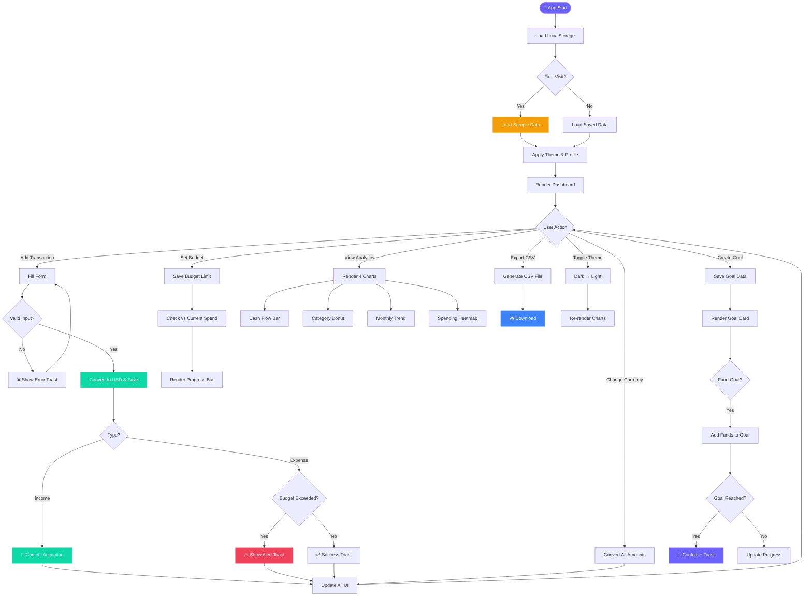
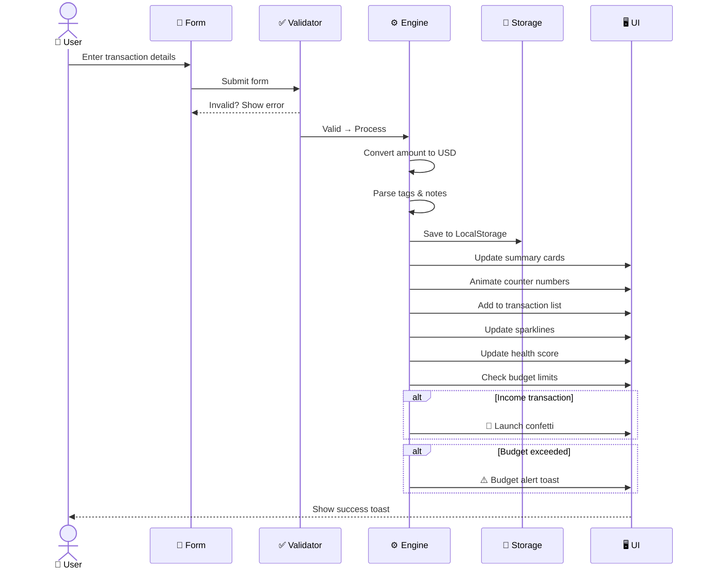
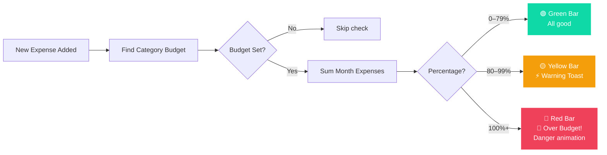
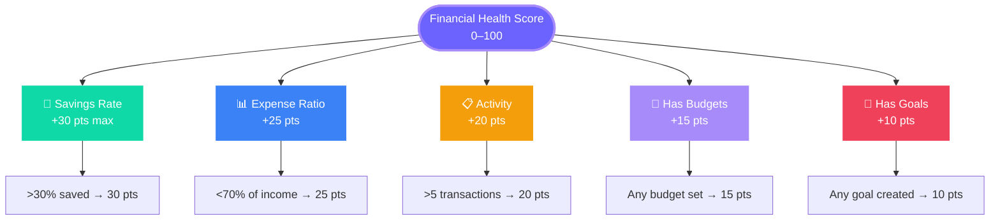
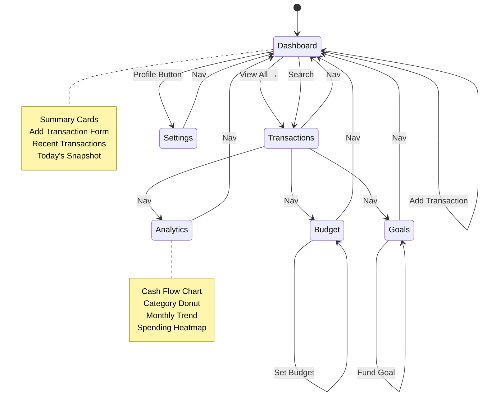
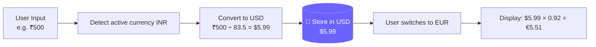
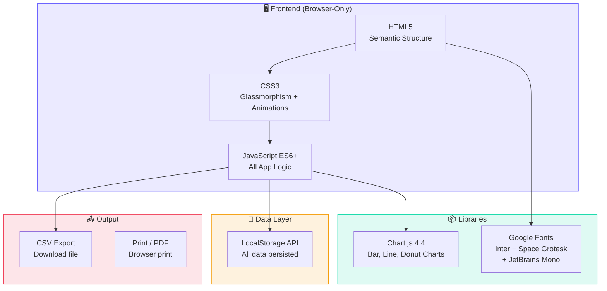

<div align="center">


# 💎 FinTrack Pro
### *Ultra-Premium Personal Finance Tracker*

<p align="center">
  
  
  
  
  
</p>

<p align="center">
  
  
  
  
  
</p>

<br/>

> **FinTrack Pro** is a feature-rich, single-page personal finance tracker with stunning glassmorphism design, animated charts, budget tracking, savings goals, multi-currency support, and a financial health score — all running entirely in the browser with zero backend.

<br/>

[](https://project-hi85m.vercel.app)
[](https://drive.google.com/file/d/17PYPaOj1A2cw33jJ0k9gX7rTFtriDs3t/view)

</div>

---

## 🎨 Color Palette & Design System

<div align="center">

| Token | Color | Hex | Usage |
|:---:|:---:|:---:|:---|
| 🟣 Accent |  | `#6c63ff` | Primary brand, buttons, highlights |
| 🟢 Income |  | `#10d9a8` | Income amounts, positive values |
| 🔴 Expense |  | `#f0415a` | Expense amounts, warnings |
| 🟡 Savings |  | `#f59e0b` | Savings rate, goals progress |
| 🔵 Accent 2 |  | `#a78bfa` | Gradients, secondary accents |
| ⬛ Dark BG |  | `#060912` | Dark mode base background |
| ⬜ Surface |  | `#0c1020` | Dark mode sidebar/cards |
| 🤍 Light BG |  | `#f5f7ff` | Light mode base background |

</div>

---

## ✨ Features Overview

<table>
<tr>
<td width="50%">

### 📊 Core Finance
- ✅ Add **Income & Expense** transactions
- ✅ Real-time **Balance, Income, Expense** summary
- ✅ **Savings Rate** with animated progress bar
- ✅ **Financial Health Score** (0–100)
- ✅ **Today's Snapshot** (daily income/spend)
- ✅ **7-day micro bar chart**

</td>
<td width="50%">

### 🎯 Advanced Features
- ✅ **Monthly Budget Tracker** with alerts
- ✅ **Savings Goals** with emoji & funding
- ✅ **Multi-currency** (USD, EUR, GBP, INR, JPY)
- ✅ **Transaction Tags** (#work, #monthly)
- ✅ **Recurring Transactions** toggle
- ✅ **CSV Export** one-click

</td>
</tr>
<tr>
<td width="50%">

### 📈 Analytics & Charts
- ✅ **Cash Flow Bar Chart** (7/30/90 days)
- ✅ **Expense Donut Chart** by category
- ✅ **Income vs Expense Trend** line chart
- ✅ **Spending Heatmap** (12 weeks)
- ✅ **Sparkline** mini-charts on cards
- ✅ **Analytics Stats Row**

</td>
<td width="50%">

### 🎨 UI & UX
- ✅ **Dark & Light mode** with saved preference
- ✅ **6 Accent Color Picker**
- ✅ **Animated floating orb** background
- ✅ **Glassmorphism** cards with shimmer
- ✅ **Confetti** animation on income/goals
- ✅ **Notifications Panel** with bell icon
- ✅ **FAB** floating action button menu
- ✅ **Keyboard shortcut** `Ctrl+K`

</td>
</tr>
</table>

---

## 🏗️ Application Architecture

```
FinTrack Pro/
│
├── 📄 index.html          # Single-page app structure
│   ├── 🔷 Sidebar          # Navigation + stats + theme toggle
│   ├── 🔷 Topbar           # Search, currency, notifications, profile
│   ├── 🔷 Section: Dashboard    # Cards, add form, recent list
│   ├── 🔷 Section: Transactions # Filter, sort, search, full list
│   ├── 🔷 Section: Budgets      # Budget form + progress bars
│   ├── 🔷 Section: Goals        # Goal form + goal cards
│   ├── 🔷 Section: Analytics    # 4 charts + heatmap
│   ├── 🔷 Section: Settings     # Profile, theme, accent, data
│   ├── 🔷 FAB Menu         # Floating action button
│   ├── 🔷 Modal            # Confirm dialog
│   └── 🔷 Toast            # Notifications
│
├── 🎨 style.css           # Full design system (1400+ lines)
│   ├── CSS Variables       # Design tokens
│   ├── Animated BG         # Orbs + grid
│   ├── Sidebar             # Navigation styles
│   ├── Cards               # Glassmorphism + sparkline
│   ├── Charts              # Chart wrappers
│   ├── Budget/Goals        # Progress bars
│   └── Responsive          # Mobile breakpoints
│
└── ⚙️ app.js              # All application logic (700+ lines)
    ├── State Management    # Single state object S{}
    ├── LocalStorage        # Persist all data
    ├── Currency Engine     # Conversion + formatting
    ├── Animated Counters   # Count-up numbers
    ├── Charts Engine       # Chart.js wrappers
    ├── Health Score        # Financial scoring
    ├── Budget Alerts       # Over-budget detection
    ├── Confetti Engine     # Canvas particle animation
    └── Export Engine       # CSV generation
```

---

## 🔄 Application Flowchart



---

## 💰 Transaction Flow



---

## 🎯 Budget Alert System



---

## 🏆 Financial Health Score



| Score | Rating | Color | Meaning |
|:---:|:---:|:---:|:---|
| 80–100 | 🌟 Excellent | 🟢 `#10d9a8` | Finances in great shape |
| 60–79 | 👍 Good | 🔵 `#6c63ff` | On the right track |
| 40–59 | ⚡ Fair | 🟡 `#f59e0b` | Some areas need attention |
| 1–39 | 📈 Needs Work | 🔴 `#f0415a` | Start tracking & budgeting |

---

## 🧭 Navigation Flow



---

## 💱 Multi-Currency Engine



| Currency | Flag | Symbol | Rate (vs USD) |
|:---:|:---:|:---:|:---:|
| US Dollar | 🇺🇸 | `$` | 1.0000 |
| Euro | 🇪🇺 | `€` | 0.9200 |
| British Pound | 🇬🇧 | `£` | 0.7900 |
| Indian Rupee | 🇮🇳 | `₹` | 83.500 |
| Japanese Yen | 🇯🇵 | `¥` | 157.80 |

> **Note:** All amounts stored internally in USD. Display values converted on-the-fly.

---

## 🖥️ Tech Stack



---

## 🗂️ Data Structure

```js
// Transaction Object
{
  id:        "lp2x9abc",          // Unique ID
  type:      "income" | "expense",
  desc:      "Monthly Salary",    // Description
  amount:    3500,                 // Always stored in USD
  category:  "Salary",
  date:      "2026-07-05",
  notes:     "July payment",
  currency:  "INR",               // Currency when added
  tags:      ["#work","#monthly"],
  recurring: true,
  recurFreq: "monthly" | "weekly" | "yearly"
}

// Budget Object
{
  "Food": 200,        // USD limit per month
  "Transport": 100,
  "Shopping": 150
}

// Goal Object
{
  id:       "gx7k2mnp",
  name:     "Emergency Fund",
  emoji:    "💰",
  target:   5000,       // USD
  current:  1200,       // USD funded so far
  deadline: "2026-12-31"
}
```

---

## 📱 Responsive Breakpoints

```
◀─────────────────────────────────────────────────────────────────────▶
 380px    540px         768px         900px         1100px      1440px
   │         │              │              │              │           │
   │ Stack   │ 2 col cards  │ Sidebar OFF  │ Single col   │ 4 cards   │
   │ all     │ 2x2 grid     │ Hamburger ON │ analytics    │ Full grid │
```

| Breakpoint | Layout Change |
|:---:|:---|
| `< 380px` | All cards stacked (1 column) |
| `< 540px` | 2×2 card grid, toolbar stacks |
| `< 768px` | Sidebar hidden, hamburger menu shown |
| `< 900px` | Dashboard grid goes to 1 column |
| `< 1100px` | Cards go to 2×2 grid |
| `≥ 1440px` | Full 4-column card grid |

---

## ⚡ Animation Catalogue

| Animation | Element | Trigger | Duration |
|:---|:---|:---|:---|
| 🌊 Orb Float | Background orbs | Always | 12s loop |
| ✨ Shimmer Stripe | Card top border | Always | 3s loop |
| 🔢 Counter | Summary amounts | Data change | 0.9s ease |
| 📉 Sparkline | Card mini-charts | Data change | Instant |
| 🎴 Section Fade | Page sections | Navigation | 0.4s ease |
| 🃏 Card Lift | Summary cards | Hover | 0.2s |
| 📋 TX Slide | Transaction items | On add | 0.35s + stagger |
| 🎯 Progress Bar | Budget/Goal bars | On load | 1.2s ease |
| 🎉 Confetti | Canvas overlay | Income added | 200 frames |
| 🔔 Badge Pulse | Budget alert | Always | 2s loop |
| 💡 Brand Glow | Sidebar brand | Always | 4s loop |
| 🌀 Ring Score | Health score | On load | 0.8s |
| 🚀 FAB Spring | FAB menu items | FAB open | 0.5s spring |
| 📦 Empty Float | Empty state icon | Always | 3s loop |
| 🍞 Toast | Notification | Action | 0.4s spring |
| 🗔 Modal Scale | Confirm dialog | Triggered | 0.5s spring |
| 👤 Profile Ripple | Avatar ring | Always | 2.5s loop |

---

## 🚀 Getting Started

### Option 1: Open directly in browser
```bash
# Simply open the file
index.html  →  Double click or drag into browser
```

### Option 2: Live Server (VS Code)
```bash
# Install Live Server extension in VS Code
# Right-click index.html → "Open with Live Server"
# App runs at: http://127.0.0.1:5500
```

### Option 3: Deploy to Vercel (Free)
```bash
# 1. Go to vercel.com/new
# 2. Drag & drop the fintack/ folder
# 3. Click Deploy
# 4. Get your live URL instantly!
```

---

## 📁 File Structure

```
fintack/
├── 📄 index.html      # Main HTML (789 lines)
├── 🎨 style.css       # Design system (1400+ lines)
├── ⚙️ app.js          # App logic (700+ lines)
└── 📖 README.md       # This file
```

---

## ⌨️ Keyboard Shortcuts

| Shortcut | Action |
|:---:|:---|
| `Ctrl + K` | Open global search |
| `Escape` | Close modal / FAB menu |
| `Tab` | Navigate form fields |

---

## 🔑 Key Design Decisions

| Decision | Reason |
|:---|:---|
| **Zero backend** | Works offline, no server costs, instant deploy |
| **LocalStorage** | Simple, fast, no auth needed |
| **USD as base currency** | Single conversion step, consistent math |
| **Chart.js via CDN** | Lightweight, no build step needed |
| **Google Fonts via CDN** | Premium typography with no setup |
| **CSS Custom Properties** | Instant theme/accent switching |
| **ES6+ Modules** | Modern JS, clean code structure |
| **Canvas confetti** | Pure browser animation, no library needed |

---

## 🎓 Learning Outcomes

This project demonstrates:

- 🏗️ **Single Page Application (SPA)** architecture without a framework
- 💾 **LocalStorage CRUD** operations
- 📊 **Chart.js** integration with dynamic data
- 🎨 **CSS Custom Properties** for real-time theming
- 🎞️ **Web Animations API** & CSS keyframes
- 🖥️ **Canvas API** for confetti & sparklines
- 💱 **Currency conversion** logic
- 📤 **CSV file generation** in browser
- ♿ **Accessibility** with ARIA labels & semantic HTML
- 📱 **Responsive design** with CSS Grid & Flexbox

---

## 👤 Author

<div align="center">

**Built with ❤️ for 50x Extension – Cohort 3.0**

*FinTrack Pro · Personal Finance Tracker*

[](https://project-hi85m.vercel.app)
[]()
[]()

</div>

---

<div align="center">

```
██████╗ ██████╗  ██████╗
██╔══██╗██╔══██╗██╔═══██╗
██████╔╝██████╔╝██║   ██║
██╔═══╝ ██╔══██╗██║   ██║
██║     ██║  ██║╚██████╔╝
╚═╝     ╚═╝  ╚═╝ ╚═════╝
```

*FinTrack Pro — Track Smart. Grow Faster.*

</div>
